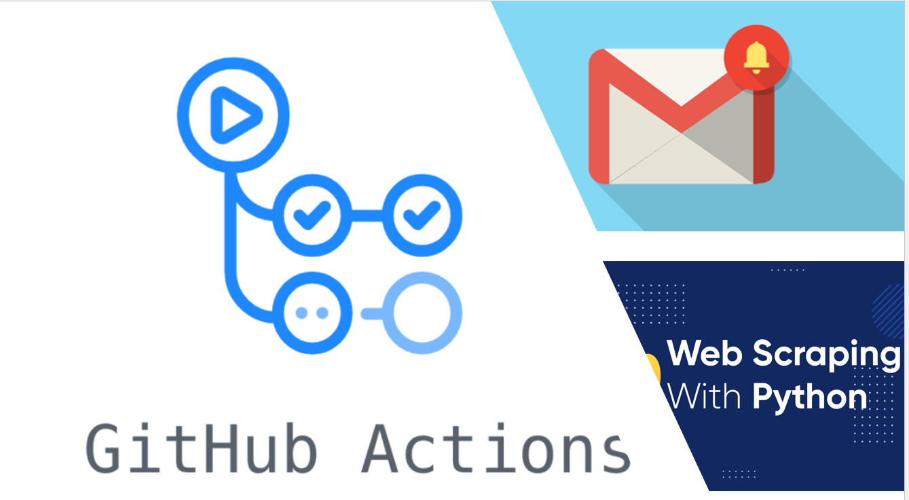

# Price-tracking-with-GitHub-Actions



This repository contains a Python script that scrapes price information from the **Flipkart** website at regular time intervals using **cron job**, compares it to previous prices, and sends an email notification if there has been a significant change.

## Requirements
To run this script, the following packages are required:

Python 3.9
requests
beautifulsoup4
pandas

You can also install these packages by running:

````
pip install -r requirements.txt
````

## Usage
To use the scraper, you'll need to provide a URL for the product you want to track. You can do this by modifying the ***URL*** variable in [log_info.py](https://github.com/Pramod07Ch/price-tracker/blob/main/log_info.py) to point to the correct URL.

You can also set a threshold for the percentage change in price that will trigger an email notification. By default, this threshold is set to 10%. You can modify this by changing the ***PRICE_THRESHOLD*** variable in [load_compare_price.py](https://github.com/Pramod07Ch/price-tracker/blob/main/log_compare_price.py).

Once you've configured the script, you can run it by running:
```
python scrape_extract_and_compare.py
```

The script will scrape the Flipkart website for price information, extract the relevant data, compare it to previous prices, and print out the price difference and percentage change. If the percentage change exceeds the threshold you set, it will also send an email notification to the address you specified.

## GitHub Actions
This repository also includes a GitHub Actions workflow that runs the scraper every specified time using **cron job** and sends an email notification if there has been a significant change in price. 

To use this workflow, you'll need to set up the following secrets:

```
EMAIL_USERNAME: The username for the email account you want to use to send notifications.
EMAIL_PASSWORD: The password for the email account you want to use to send notifications.
```

To enable the workflow, simply click the "***Use this template***" button at the top of the repository page to create a new repository based on this template. Once you've created the repository, go to the "***Settings***" tab and then the "***Secrets***" tab, and add your email username and password as secrets.

License
This code is licensed under the MIT License. See the LICENSE file for more information.
